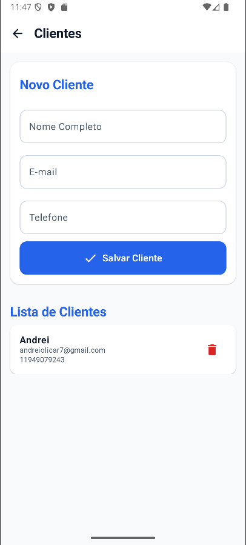
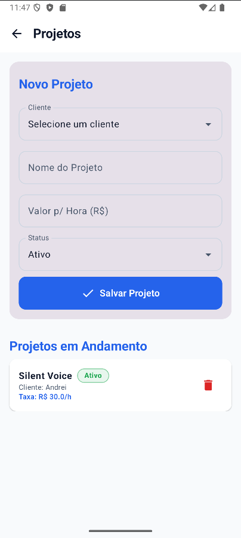
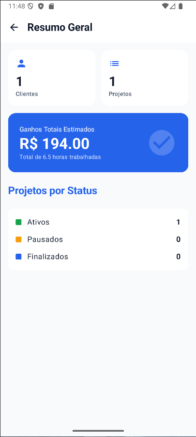

# FreelanceControlMobile

O **FreelanceControlMobile** é um aplicativo Android moderno desenvolvido para facilitar a gestão de profissionais freelancers. Com ele, é possível organizar clientes, detalhar projetos, registrar horas trabalhadas com precisão e acompanhar o desempenho financeiro através de um painel de resumo intuitivo.

## 🎯 Objetivo

O projeto visa fornecer uma ferramenta prática e eficiente para o controle de tempo e faturamento, automatizando cálculos de duração e valores estimados, garantindo que o profissional tenha uma visão clara de seus rendimentos e prazos.

## 🛠 Tecnologias Utilizadas

*   **Linguagem:** [Kotlin](https://kotlinlang.org/)
*   **Interface:** [Jetpack Compose](https://developer.android.com/jetpack/compose) (UI Declarativa)
*   **Design System:** Material 3
*   **Banco de Dados Local:** SQLite (via `SQLiteOpenHelper`)
*   **Ferramenta de Desenvolvimento:** Android Studio

## 🚀 Funcionalidades

1.  **Menu Principal:** Navegação centralizada entre todas as áreas do sistema.
2.  **Gestão de Clientes:** Cadastro e listagem de clientes (Nome, E-mail, Telefone).
3.  **Gestão de Projetos:** Criação de projetos vinculados a clientes específicos.
    *   Definição de valor por hora.
    *   Controle de status (Ativo, Pausado, Finalizado).
4.  **Registro de Horas:** Lançamento de tempo trabalhado com:
    *   Máscaras automáticas nos campos de data e horário.
    *   Cálculo automático de duração em minutos e horas decimais.
    *   Cálculo automático do valor a ser cobrado.
5.  **Confirmações de Segurança:** Diálogos de confirmação antes de excluir qualquer registro.
6.  **Dashboard (Resumo):** Visualização rápida do total de clientes, projetos, horas acumuladas e ganhos estimados.

## ✅ Requisitos Atendidos

*   Interface profissional com paleta de cores azul e foco em UX.
*   Persistência de dados local segura com SQLite.
*   Integridade referencial utilizando **Foreign Keys** com `ON DELETE CASCADE`.
*   Regras de negócio implementadas em Kotlin para processamento de tempo e valores.
*   Código fonte organizado e comentado.

## 📸 Screenshots

Abaixo, representações visuais das principais telas do sistema:

1.  **Tela Inicial:** Menu principal de navegação.
    

2.  **Clientes:** Cadastro e visualização de contatos.
    

3.  **Projetos:** Gestão de contratos e taxas horárias.
    

4.  **Registros de Horas:** Lançamentos diários e cálculos automáticos.
    

5.  **Resumo Geral:** Dashboard financeiro e de produtividade.
    

## 🗄 Estrutura do Banco de Dados

O banco de dados `freelance_control.db` é composto pelas seguintes tabelas:

### 1. `clients`
*   `id`: Identificador único (Primary Key).
*   `name`: Nome do cliente.
*   `email`: Endereço de e-mail.
*   `phone`: Telefone de contato.

### 2. `projects`
*   `id`: Identificador único (Primary Key).
*   `client_id`: Referência ao cliente (**Foreign Key**).
*   `title`: Título do projeto.
*   `description`: Detalhes do projeto.
*   `hourly_rate`: Valor cobrado por hora.
*   `status`: Situação atual (ativo, pausado, finalizado).

### 3. `time_entries`
*   `id`: Identificador único (Primary Key).
*   `project_id`: Referência ao projeto (**Foreign Key**).
*   `work_date`: Data do trabalho (AAAA-MM-DD).
*   `start_time`: Hora de início (HH:mm).
*   `end_time`: Hora de término (HH:mm).
*   `duration_minutes`: Tempo total calculado em minutos.
*   `notes`: Observações adicionais.

---

### 🔗 Explicação das Foreign Keys (Integridade)

O sistema utiliza chaves estrangeiras para manter a consistência dos dados:
*   `projects.client_id` → referencia `clients.id`: Garante que um projeto sempre pertença a um cliente real. Se um cliente for excluído, todos os seus projetos são removidos automaticamente via `CASCADE`.
*   `time_entries.project_id` → referencia `projects.id`: Garante que registros de horas estejam sempre atrelados a um projeto. A exclusão de um projeto remove todos os seus lançamentos de horas.

### 🧮 Lógica de Cálculo de Horas e Valores

Os cálculos são realizados automaticamente pela classe utilitária `TimeCalculator`:
1.  **Duração (minutos):** `Diferença entre Hora Final e Hora Inicial`.
2.  **Horas Decimais:** `Duração em Minutos / 60`.
3.  **Valor Estimado:** `Horas Decimais × Valor por Hora (definido no projeto)`.

*Exemplo: 90 minutos trabalhados em um projeto de R$ 100,00/h resulta em 1.5h e um valor de R$ 150,00.*

## 📂 Estrutura Sugerida do Projeto

*   `data/`: Contém o `DatabaseHelper` e as classes `DAO` (Data Access Object).
*   `model/`: Contém as `data classes` que representam as entidades do banco.
*   `util/`: Classes utilitárias como o `TimeCalculator`.
*   `ui/`: Composable functions para as telas e componentes de interface.
*   `ui/theme/`: Definições de cores, tipografia e tema do app.

## 🏁 Como executar o projeto

Para rodar o projeto localmente, siga os passos:

1.  **Clonar ou baixar** este repositório para sua máquina.
2.  Abrir o **Android Studio**.
3.  Selecionar a opção **"Open"** e escolher a pasta do projeto.
4.  Aguardar o **Gradle** sincronizar todas as dependências.
5.  Conectar um dispositivo físico com depuração USB ativada ou iniciar um **Emulador Android**.
6.  Clicar no botão **"Run" (triângulo verde)** na barra superior.

## 🛠 Melhorias Futuras

*   Implementação de edição de registros existentes.
*   Exportação de relatórios em PDF para envio aos clientes.
*   Gráficos detalhados no Dashboard.
*   Suporte a tema escuro (Dark Mode) completo.

## 👨‍💻 Autor

Desenvolvido por **Andrei Oliveira Carneiro**.
