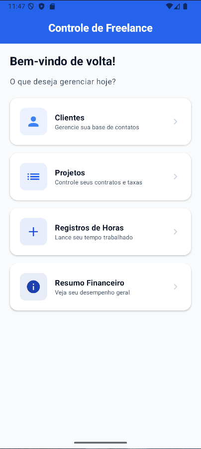
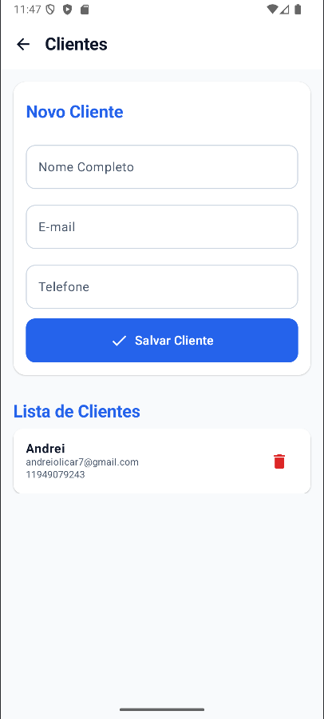
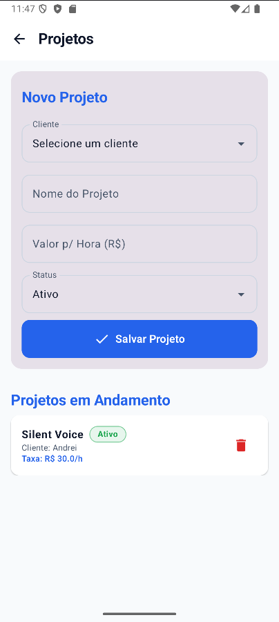
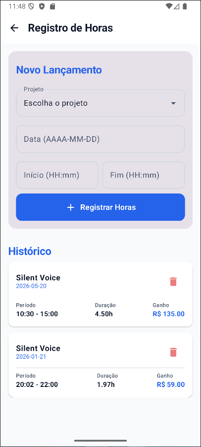
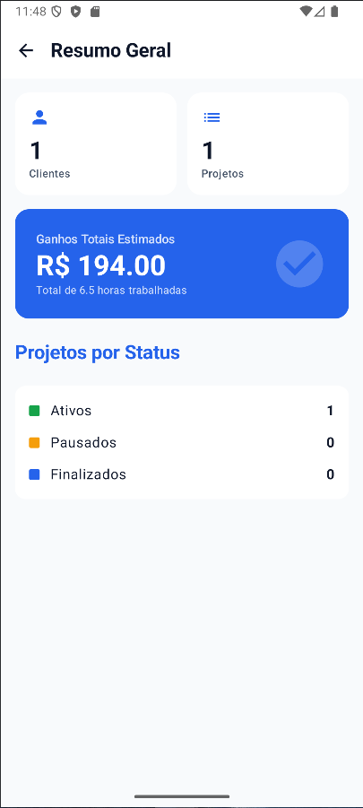

# FreelanceControlMobile

O **FreelanceControlMobile** é um aplicativo Android moderno desenvolvido para facilitar a gestão de profissionais freelancers. Com ele, é possível gerenciar o ciclo de vida completo de clientes e projetos, registrar horas trabalhadas com precisão e acompanhar o desempenho financeiro através de um painel de resumo intuitivo.

## 🎯 Objetivo

O projeto fornece uma solução robusta para o controle de tempo e faturamento, permitindo a manutenção completa de dados (CRUD) de clientes e projetos, automatizando cálculos de duração e valores, garantindo que o profissional tenha controle total sobre seu fluxo de trabalho.

## 🛠 Tecnologias Utilizadas

*   **Linguagem:** [Kotlin](https://kotlinlang.org/)
*   **Interface:** [Jetpack Compose](https://developer.android.com/jetpack/compose) (UI Declarativa)
*   **Design System:** Material 3
*   **Banco de Dados Local:** SQLite (via `SQLiteOpenHelper`)
*   **Ferramenta de Desenvolvimento:** Android Studio

## 🚀 Funcionalidades

1.  **Menu Principal:** Navegação centralizada e moderna.
2.  **CRUD Completo de Clientes:** 
    *   Cadastrar novos clientes.
    *   Listar todos os clientes cadastrados.
    *   **Editar** informações de clientes existentes.
    *   Excluir clientes com confirmação.
3.  **CRUD Completo de Projetos:**
    *   Cadastrar projetos vinculados a clientes.
    *   Listar projetos com status e taxas.
    *   **Editar** detalhes de projetos, taxas e status.
    *   Excluir projetos com confirmação e exclusão em cascata.
4.  **Registro de Horas:** Lançamento de tempo trabalhado com:
    *   Máscaras automáticas nos campos de data e horário.
    *   Cálculo automático de duração e horas decimais.
    *   Cálculo automático do valor estimado baseado na taxa do projeto.
5.  **Dashboard (Resumo):** Estatísticas consolidadas e ganhos estimados.

## ✅ Requisitos Atendidos

*   **Dois CRUDs Completos:** Gestão total de Clientes e Projetos (Criação, Leitura, Atualização e Exclusão).
*   **Persistência com SQLite:** Uso eficiente de banco de dados local.
*   **Integridade Referencial:** Uso de **Foreign Keys** com `ON DELETE CASCADE`.
*   **Cálculo Automático:** Lógica para processamento de horas e valores financeiros.
*   **Interface Moderna:** Design profissional com paleta azul e alta usabilidade (UX).

## 📸 Screenshots

Abaixo, as principais telas do sistema:

1.  **Tela Inicial:** Menu principal de navegação.  
    

2.  **Clientes:** Gestão completa de contatos.  
    

3.  **Projetos:** Gestão de contratos e taxas horárias.  
    

4.  **Registros de Horas:** Lançamentos diários e cálculos automáticos.  
    

5.  **Resumo Geral:** Dashboard financeiro e de produtividade.  
    

## 🗄 Estrutura do Banco de Dados

### Entidades e Relacionamentos
O sistema é estruturado em torno de três pilares principais:
1.  **Cliente:** Possui CRUD completo. É a entidade base para os projetos.
2.  **Projeto:** Possui CRUD completo e está obrigatoriamente vinculado a um cliente (**Foreign Key**).
3.  **Registro de Horas:** Vinculado a um projeto (**Foreign Key**), permitindo o rastreio preciso do tempo e faturamento.

### 🔗 Regras de Integridade (Foreign Keys)
*   `projects.client_id` → referencia `clients.id`: Garante que um projeto pertença a um cliente. A exclusão de um cliente remove seus projetos automaticamente.
*   `time_entries.project_id` → referencia `projects.id`: Garante que horas sejam lançadas em projetos válidos. A exclusão de um projeto remove seus registros de horas.

### 🧮 Lógica de Cálculo
*   **Duração (minutos):** Diferença entre o horário de término e início.
*   **Horas Decimais:** Minutos totais convertidos para base decimal (ex: 30min = 0.5h).
*   **Valor Estimado:** Horas decimais multiplicadas pelo valor/hora definido no projeto.

## 🏁 Como executar o projeto

1.  **Clonar ou baixar** o projeto.
2.  Abrir no **Android Studio**.
3.  Aguardar o **Gradle** sincronizar.
4.  Executar em um **emulador** ou dispositivo Android físico.

## 👨‍💻 Autor

Andrei Oliveira Carneiro - 3° DS AMS
